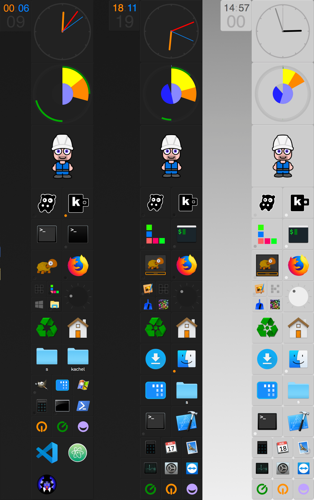
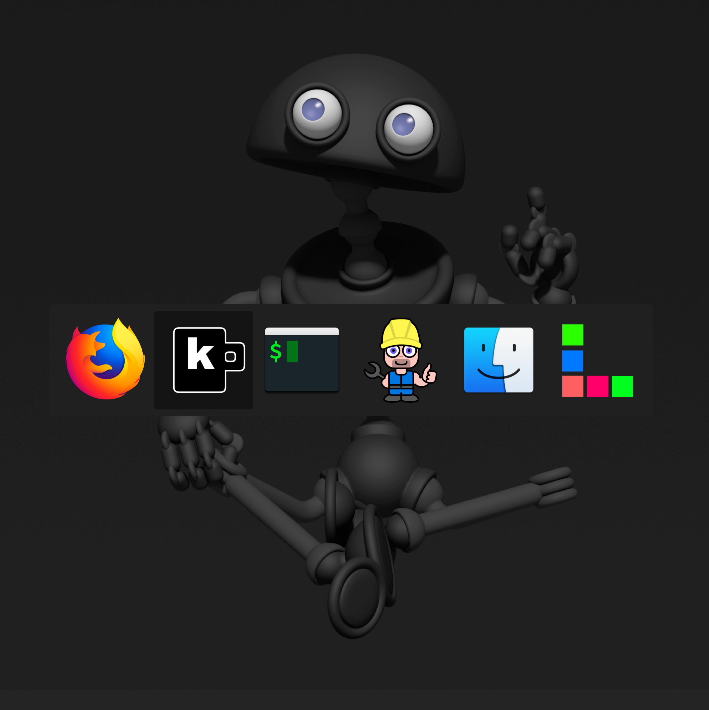

 
 
 

# kachel 

Dock for Windows and macOS

## Fullscreen Zoom

Zoom the desktop similar to the ctrl-mousewheel experience on mac (Alt+Z)

## Window Management

Position windows via keyboard shortcuts similiar to divvy or magnet (Alt+Ctrl+[Up|Left...|1...4])

## Application Switcher

Switch between applications similar to the cmd-tab switch on mac (Ctrl+Tab):

