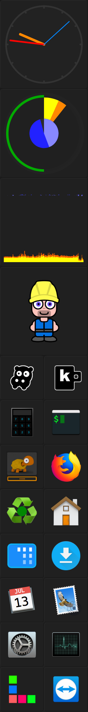
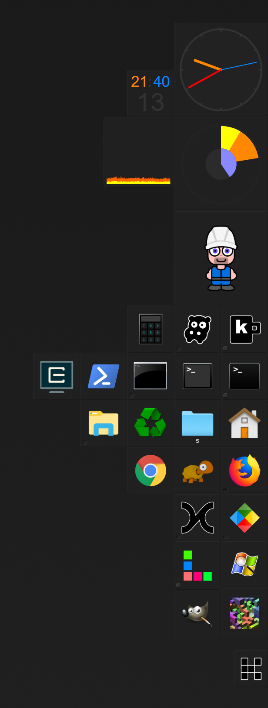

 
 
 
<table bgcolor="#333"><tr>
<td>

</td>
<td>

</td>
</tr></table>

- provides a full-screen zoom similar to the ctrl-mousewheel experience on mac (Alt+Z)
- positions windows on keyboard shortcuts similiar to divvy or magnet (Alt+Ctrl+[Up|Left...|1...4])
- switches between applications similar to the cmd-tab switch on mac (Ctrl+Tab):

